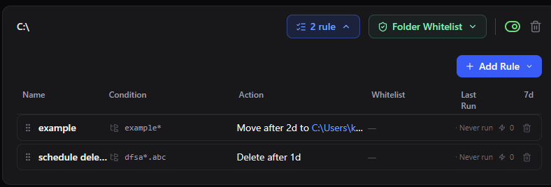
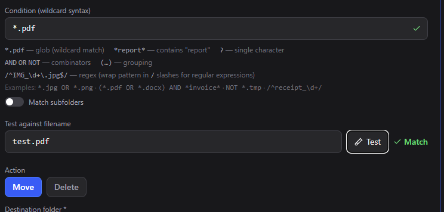
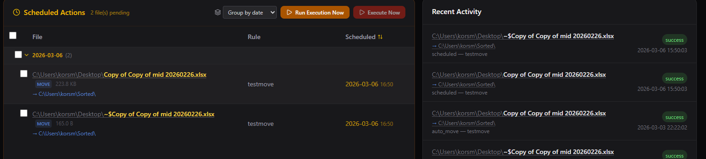
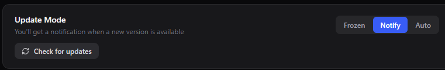

# Folder Organizer

A lightweight desktop application that monitors user-configured folders and automatically organizes files based on composable rules.

## Features
### What it does 

- **Auto-move/delete** files based on rules that can be set up in seconds!

- **Match testing** Not sure if a file/folder name matches the condition? Easy way to confirm it!


- **Log all changes done/will be done** Logs stored in a local SQLite database. And you will be able to see all the files scheduled for moving/deletion.

- **Full control of updates**. You own your system, feel free to choose between silent auto-update, update with confirmation, and version freeze.


### What it doesn't do
- **Steal your data**: All data is stored locally. The only time it needs internet access is checking for updates, and you can turn that off.
- **Modify without logging**: All file operations are logged.
- **Affect whitelisted items**: Files/folders on the whitelist are never modified by rules.

## Tech Stack

| Layer | Technology |
|-------|-----------|
| Desktop shell | Tauri v2 |
| Backend | Rust |
| Frontend | React 19 + TypeScript |
| Styling | Tailwind CSS v4 |
| Database | SQLite (via rusqlite) |
| File watching | notify + notify-debouncer-mini |

## Development

### Prerequisites
- Rust toolchain (stable)
- Node.js 18+
- npm

### Commands
```bash
npm install              # Install frontend deps
npm run tauri dev        # Start dev mode (Vite + Rust, hot reload)
npm run tauri build      # Production build
cd src-tauri && cargo test  # Run Rust unit tests
```

First build takes several minutes to compile Rust dependencies. Subsequent builds are incremental (~5-10s).

## Project Structure

```
src/                  # React frontend
  pages/              # Dashboard, Folders, Rules, Activity, DataExplorer, Settings
  components/         # Layout, Sidebar
  i18n/               # Translations (en, fr, zh)
  api.ts              # Typed wrappers for Tauri IPC calls
  types.ts            # TypeScript mirrors of Rust types
src-tauri/src/        # Rust backend
  config.rs           # App config types, load/save JSON
  condition.rs        # Condition parser, evaluator, tests
  rules.rs            # Rule engine: evaluate + execute
  watcher.rs          # File system watcher (notify)
  scheduler.rs        # Periodic cleanup, deletion processing
  db/                 # SQLite database module
  commands/           # Tauri IPC command handlers
  lib.rs              # App entry point
claudeDoc/            # LLM context docs (architecture, progress, TODO)
```

## Data Storage

All data is stored locally in `%APPDATA%/folder-organizer/`:

| File | Contents |
|------|----------|
| `config.json` | Watched folders, rules, app settings |
| `data.db` | Activity log, file index, undo history, scheduled deletions |
| `trash_staging/` | Safe-deleted files (recoverable for 7 days) |

## License

[MIT](LICENSE)
